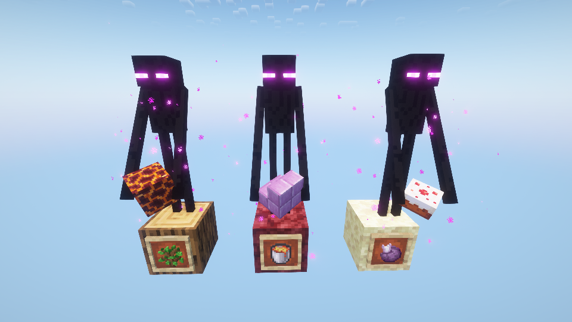

# Endermen Spawn with Blocks
A small tweak which makes Endermen more useful by having them spawn with blocks from other dimensions.

From now on, when encountering Endermen in your world, you will notice that some of them hold blocks
from other dimensions you haven't yet visited. Overworld Endermen may hold Soul Sand, Endermen from The Nether
can provide you with Purpur Blocks, while Endermen which spawn in The End sometimes carry... cakes?
With this mod installed, there will be a brand-new way of getting resources from other
dimensions without even leaving you own, or farm resources that shouldn't be infinite, albeit only at a slow rate!

## Loot tables
*Possible held blocks are sorted in block tags, sorted by dimension.*
* A held block tag is set at the following location: 
  `endermen_spawnèwith_blocks:<dimension namespace>/<dimension path>/blocks`

Hence, the vanilla dimension tags are as follows: 
* [**Overworld**](src/main/resources/data/endermen_spawn_with_blocks/tags/block/minecraft/overworld/blocks.json):
  `endermer_spawn_with_blocks:minecraft/overworld/blocks`
* [**The Nether**](src/main/resources/data/endermen_spawn_with_blocks/tags/block/minecraft/the_nether/blocks.json):
  `endermer_spawn_with_blocks:minecraft/the_nether/blocks`
* [**The End**](src/main/resources/data/endermen_spawn_with_blocks/tags/block/minecraft/the_end/blocks.json)
  `endermer_spawn_with_blocks:minecraft/the_end/blocks`

### Add a custom dimension set of blocks
To add a custom set of blocks for a custom dimension, or even overhaul the default ones,
you need to define the appropriate block tag via a data pack.

As mentioned [precedently](#loot-tables), these tags must fit the registered dimension.
Hence, in order to add a set to, for example, the
[Twilight Forest](https://github.com/TeamTwilight/twilightforest-fabric) dimension, you
would need to define a block tag with the following ID:
`endermen_spawn_with_blocks:twilightforest/twilight_forest/blocks` and put in your values.
That would mean putting your tag JSON file in the datapack as
`data/endermen_spawn_with_blocks/tags/block/twilightforest/twilight_forest/blocks.json`

## Config options

This mod is also quite customizable, and you can change pretty much anything you don't like.
* Too many Endermen with blocks? Not a problem, you can change the chance in the config file.
* Endermen keep placing weird blocks in a dimension? You can blacklist them from placing blocks
* in certain dimensions with the `endermen_spawn_with_blocks:blacklist` _dimension_ tag
(the End dimension is blacklisted by default, you would need to overhaul the tag to enable it).
* Additionally, you can also blacklist any blocks which you think Endermen shouldn't be able to place
with the `endermen_spawn_with_blocks:blacklist` _block_ tag.

_Beware of properly assigning your tags, dimensions in the `dimension` folder, blocks in the `block` folder_

## Go check it out on [CurseForge](https://www.curseforge.com/minecraft/mc-mods/endermen-spawn-with-blocks) or [Modrinth](https://modrinth.com/mod/endermen-spawn-with-blocks)!
